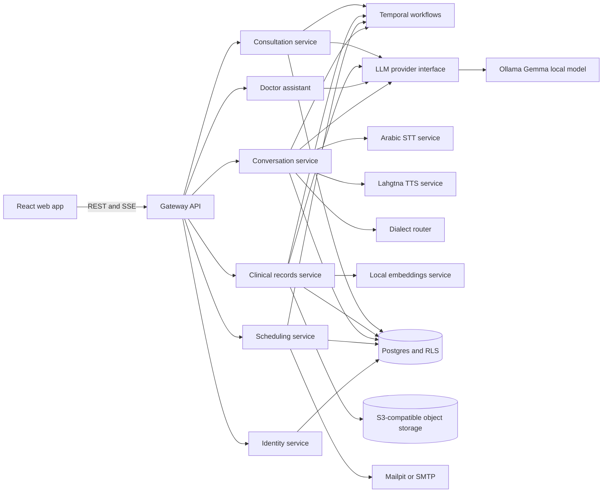
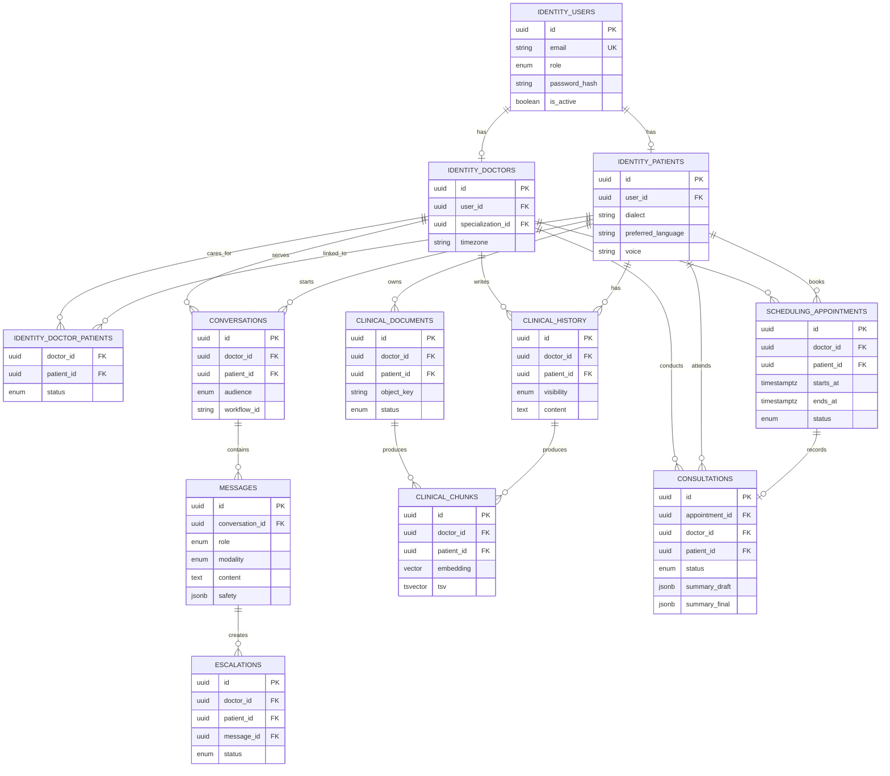

# Nafas

An AI assistant for patients and doctors, in Arabic (every major dialect) and
English. It is a web app for now; messaging channels come later.

- **Patients** book visits, and chat with their doctor's assistant by text or
  voice. It answers general questions within the doctor's specialty, sends
  anything sensitive to the doctor, and catches emergencies in plain code
  before any model. They get reminders by email, and see the notes and visit
  summaries their doctor shares.
- **Doctors** get a schedule and a patient list, and a timeline for each
  patient: appointments, notes, documents (OCR'd and searchable), escalated
  questions and recorded visits. They get an assistant that reads the patient's
  record, and in-person visits recorded into a SOAP draft they review before
  anything is filed.

The plan is in [docs/PLAN.md](docs/PLAN.md) and the order of work in
[docs/CHECKLIST.md](docs/CHECKLIST.md). Operations (SLOs, capacity, deploys
and the runbook) are in [docs/operations/](docs/operations/).

Every feature is its own service. They all live in this one repository as a uv
workspace and coordinate through Temporal.

## Contents

- [Getting started](#getting-started)
  - [Requirements](#requirements)
  - [Setup](#setup)
  - [Local startup and verification](#local-startup-and-verification)
  - [Architecture diagrams](#architecture-diagrams)
- [Running it](#running-it)
  - [The whole stack](#the-whole-stack)
  - [One service on the host](#one-service-on-the-host)
- [How the code is arranged](#how-the-code-is-arranged)
  - [Services and the core library](#services-and-the-core-library)
  - [Inside a service](#inside-a-service)
  - [Adding a service](#adding-a-service)
- [Operations](#operations)
- [Conventions](#conventions)
  - [Formatting and linting](#formatting-and-linting)
  - [Pre-commit hooks](#pre-commit-hooks)
  - [Tests](#tests)
- [Things that will bite you](#things-that-will-bite-you)
- [License](#license)

## Getting started

### Requirements

- Python 3.12 (pinned in `.python-version`)
- [uv](https://docs.astral.sh/uv/)
- Node 22, for the web app in `web/` (`npm ci` there once).
- Docker with Compose, on the **native engine** (not Docker Desktop), plus the
  NVIDIA container toolkit for the GPU services. The `Makefile` pins the
  `default` context, and `make gpu-check` proves a container can see the GPU.
  The suite still runs without Docker: database and storage tests skip.

### Setup

```bash
uv sync                       # every workspace package, editable
uv run pre-commit install     # once, so the hooks run on every commit
cp .env.example .env          # optional: every setting already has a default

make up                       # Postgres :5433, Temporal :7234 (UI :8234), S3 :8333, Mailpit :8025, services
make migrate                  # apply database migrations
make seed                     # the specializations
make storage                  # create the bucket
```

A doctor to log in as, with hours to book:

```bash
uv run python -m nafas_identity.cli create-doctor --email dr@example.com \
  --name-en "Dr Example" --name-ar "د. مثال" --specialization cardiology
uv run python -m nafas_scheduling.cli set-hours --doctor-id <printed id> \
  --hours wed=17:00-21:00 --hours sat=10:00-14:00/in_person
```

Patients sign up in the app. `nafas_identity.cli disable-account --email ...`
turns an account off (and `enable-account` on again).

Check it works:

```bash
make test
```

### Local startup and verification

For a machine without an NVIDIA GPU, use the CPU compose override. The local
stack uses Ollama as the LLM provider and pulls the configured `gemma4:e4b` model
into its own volume. Postgres remains the single local database; conversation,
clinical-records and the other services use separate schemas and service roles.

If a host gateway is already running, stop it with `Ctrl+C` before starting the
Compose stack because both use port `8000`. To identify a process holding the
port, run `ss -ltnp 'sport = :8000'`. A stale process owned by another user may
require the host administrator to stop it.

Follow this sequence from the repository root:

1. Install the Python workspace and frontend dependencies.
2. Copy `.env.example` to `.env` only when `.env` does not already exist. Keep
  `LLM_PROVIDER=ollama` and set the local model to the tag installed in Ollama,
  normally `gemma4:e4b`.
3. Stop any host gateway using port `8000`.
4. Start the complete stack. Use `make up` with NVIDIA GPU support or
  `make up-cpu` without it.
5. Apply migrations with `make migrate`.
6. Seed specializations with `make seed`.
7. Create the local object-storage bucket with `make storage`.
8. Create a test doctor and configure bookable hours.
9. Verify health, API docs, model loading, and the web UI.
10. Run `make test` only after the dependent services report healthy.

```bash
uv sync
cd web && npm ci && cd ..

# Do not overwrite an existing .env containing local settings.
test -f .env || cp .env.example .env

ss -ltnp 'sport = :8000' || true
make up-cpu                         # or: make up
make migrate
make seed
make storage
```

Create a test doctor and configure bookable hours. Save the printed doctor ID
for API or integration tests:

```bash
uv run python -m nafas_identity.cli create-doctor \
  --email dr@example.com \
  --name-en "Dr Example" \
  --name-ar "د. مثال" \
  --specialization cardiology

uv run python -m nafas_scheduling.cli set-hours \
  --doctor-id <printed-id> \
  --hours wed=17:00-21:00 \
  --hours sat=10:00-14:00/in_person
```

Verify the running stack:

```bash
curl -fsS http://localhost:8000/health
curl -fsS http://localhost:8000/docs >/dev/null
docker compose logs --no-log-prefix --tail=50 llm-model
```

Open these local interfaces:

- Web app: `http://localhost:8088`
- Gateway API documentation: `http://localhost:8000/docs`
- Gateway health: `http://localhost:8000/health`
- Ollama: `http://localhost:11434`
- Mailpit: `http://localhost:8025`

The gateway is an API and does not serve the frontend at `/`; `GET /` returning
`404` is expected. Use the web app on port `8088` or the API documentation on
port `8000` instead.

Run the complete local checks after the services are healthy:

```bash
make test
```

If the Ollama image is slow to pull, wait for `ollama/ollama` to finish before
running migrations. The local host Ollama endpoint can be checked independently:

```bash
curl -fsS http://localhost:11434/api/tags
curl -fsS http://localhost:11434/v1/chat/completions \
  -H 'Content-Type: application/json' \
  -d '{"model":"gemma4:e4b","messages":[{"role":"user","content":"Reply with exactly OK."}],"max_tokens":8}'
```

### Architecture diagrams

The web app is the only public application surface. The gateway authenticates
the request and calls the service that owns the data. Temporal coordinates
long-running workflows; provider interfaces keep model and storage choices
replaceable.



The database is one Postgres database with service-owned schemas, not one
database per doctor. Clinical rows carry both `doctor_id` and `patient_id`;
row-level security and scoped transactions enforce access.



## Running it

### The whole stack

`make up` builds and starts the infrastructure and every service that exists
so far. On a machine without an NVIDIA GPU, use `make up-cpu`, where GPU
services fall back to the CPU. `make logs`, `make ps` and `make down` do what
they say.

| Service | Where | What |
| --- | --- | --- |
| web | :8088 | **the app**: patient portal and doctor portal (nginx; `make web-dev` for hot reload on :5173) |
| gateway | :8000 | the web app's API: sessions, rate limits (shared across replicas), every route the app calls |
| identity | :8010 | accounts, the doctor directory, care links, consents |
| doctor-assistant | :8020 | the doctor's assistant: read-only tools over the selected patient, streamed over SSE |
| scheduling | :8030 | hours, slots, holds and bookings to the minute, notices and emails (`BookingWorkflow`) |
| conversation | :8040 | the patient's chat: intent, safety gates, booking tools, escalations, voice (`PatientConversationWorkflow`) |
| clinical-records | :8050 | history entries, documents (OCR, image descriptions), hybrid search (`DocumentIngestionWorkflow`) |
| consultation | :8060 | recorded visits: transcript, SOAP draft, review, filing (`ConsultationWorkflow`) |
| stt | :8420 | speech to text on the GPU (Whisper large-v3-turbo, Arabic dialects) |
| dialect-router | :8410 | Arabic dialect identification on the GPU |
| embeddings | :8430 | bge-m3 on the CPU |
| tts | :8440 | spoken replies on the GPU, one voice per dialect |
| mailpit | :8025 | catches every email on a laptop |

Internal APIs sit behind `X-Internal-Token`. Every service has `/health`
(its commit, environment, model IDs and prompt versions) and `/metrics`.
`make monitoring` adds Prometheus (:9090) with the alert rules and Grafana
(:3000) with the overview dashboard.

### One service on the host

While working on a service, run it on the host against the containers:

```bash
uv run python -m nafas_gateway.main
```

## How the code is arranged

### Services and the core library

```
packages/core/              nafas_core: settings, logging, tracing, metrics, db, Temporal,
                            provider interfaces (llm, stt, tts, storage, embeddings, email),
                            internal clients, the audit log, start-up checks
services/gateway/           nafas_gateway: the web app's API
services/identity/          nafas_identity: accounts, doctors, patients, consents
services/scheduling/        nafas_scheduling: hours, appointments, notices, emails
services/conversation/      nafas_conversation: the patient's chat, safety gates, escalations; evals/
services/clinical_records/  nafas_clinical: history, documents, search
services/doctor_assistant/  nafas_doctor_assistant: the doctor's assistant
services/consultation/      nafas_consultation: recorded visits
services/stt, tts, dialect_router, embeddings/   inference services, outside the workspace
web/                        the React app: patient and doctor portals, Arabic (RTL) and English
alembic/                    one migration history for every service's schema
deploy/                     Postgres roles, Prometheus rules, Grafana, SeaweedFS
docker/                     the shared Dockerfile for workspace services
scripts/                    storage setup, backups, load test, feedback export, release check, GPU and human checks
docs/                       the plan, the checklist, operations
```

The service map and its rules are in [docs/PLAN.md §4](docs/PLAN.md). In short:
- A service owns one Postgres schema and one Temporal task queue (`nafas_core.temporal.TaskQueue`).
- It logs in with a database role that holds its own schema and nothing else, and row-level security scopes every row to its doctor or patient.
- It reaches anything else only by calling the service that owns it.
- Foreign keys into another service's schema live in the migrations, never on ORM models, so a service runs on its own code alone.

The inference services (`stt`, `tts`, `dialect_router`, `embeddings`) sit
outside the workspace, with their own lockfile (CUDA-pinned PyTorch) and their
own Dockerfile.

### Inside a service

The shape is deliberate: logic in the middle, adapters at the edges.

| Module | Holds | Rule |
| --- | --- | --- |
| `api.py` | The internal API | Validate, start or signal a workflow, map errors. No logic. |
| `activities/` | Temporal activities | One side effect each, a thin wrapper over `logic`. |
| `workflows/` | Temporal workflows | Decide order. Never do I/O. |
| `schemas/` | Dataclasses crossing a Temporal boundary | Plain dataclasses; they get encoded to JSON. |
| `logic/` | The actual work | No Temporal, no FastAPI. Testable by calling a function. |
| `prompts/` | Prompts as data | A reviewable diff in one place, versioned. |
| `models.py` | ORM models | On `nafas_core.db.Base`, in the service's own schema. |
| `events.py` | Starting and signalling workflows | Behind a replaceable hook, so tests record instead. |
| `main.py` | Entrypoint | `start_service(...)`, then the API and the worker in one process (`serve_with_worker`). |

The reason for the split is testing: `logic` has no framework imports, so most
of the suite never starts a server or a task queue.

### Adding a service

1. `services/<name>/pyproject.toml` depends on `nafas-core` with
   `{ workspace = true }`, and the root `pyproject.toml` gains it as a
   dependency and a source.
2. Its package is `services/<name>/nafas_<name>/`, laid out as above, with tests
   in `services/<name>/tests/`.
3. If it runs a worker, add its queue to `TaskQueue`. If it has tables, add its
   models module to `MODEL_MODULES` in `alembic/env.py`.
4. Its schema comes from `create_service_schema(...)` in a migration, its
   login from `deploy/postgres/roles.sql`, and its tables join the isolation
   sweep (`services/gateway/tests/test_isolation_sweep.py`), which fails until they do.
5. `instrument(app, "<name>")` and a `/health` from `health_info(...)` in its `api.py`.
6. Add it to `docker-compose.yml` with `docker/service.Dockerfile` and its
   `PACKAGE` and `MODULE` build arguments, and to `docker-compose.prod.yml`
   with its own database login.

## Operations

| | |
| --- | --- |
| `make monitoring` | Prometheus and Grafana beside the stack; alert rules in `deploy/prometheus/alerts.yml`, tested by `promtool` in CI |
| `make load-test` | 50 simulated patients for a minute; fails if a route misses its SLO ([slo.md](docs/operations/slo.md), [capacity.md](docs/operations/capacity.md)) |
| `make backup` | the database and every stored object, with checksums, encrypted with `AGE_RECIPIENT` |
| `make restore-drill BACKUP=...` | restores a backup into a scratch database and checks it |
| `make images` | every image tagged with this commit, for a release |
| `make release-check` | every service up, in the right environment, on the right commit |
| `make export-feedback` | de-identified datasets from patients who opted in: rated replies, escalations, visit-note edits |

Staging and production run `docker-compose.yml` with
`docker-compose.prod.yml` over it: every secret is required, only the web
proxy is published, and each service refuses to start on laptop defaults. A
first deploy, promotion and rollback are in
[deploy.md](docs/operations/deploy.md); what to do when an alert fires is in
the [runbook](docs/operations/runbook.md).

## Conventions

### Formatting and linting

black and ruff, both at line length 130, configured in `pyproject.toml`. ruff
runs pycodestyle, pyflakes, isort, pyupgrade and bugbear.

```bash
uv run black .
uv run ruff check --fix .
```

### Pre-commit hooks

`uv run pre-commit install` once, then every commit runs black, ruff, the
standard whitespace and YAML/TOML checks, a private-key scan, the full test
suite, and a check that this file's contents block is current.

Regenerate the contents after editing a heading:

```bash
uv run python scripts/toc.py
```

### Tests

`pytest` with `asyncio_mode = "auto"`, so an `async def test_` needs no
decorator. Settings are a singleton, and the root `conftest.py` resets it around
every test and points scratch space at a temporary directory.

- Each package keeps its tests in its own `tests/`, and `uv run pytest` at the root runs them all.
- Tests that take the `database` fixture migrate a `nafas_test` database and skip without Postgres.
- GPU services' suites run in their own environments. `make test` runs everything.
- `services/conversation/evals/safety.jsonl` is the safety eval set; it runs against the real model when `ANTHROPIC_API_KEY` is set (CI's `safety-eval` job).
- The web app's tests: `cd web && npm test`.

## Things that will bite you

**Run one generation of workers per task queue.** Each queue belongs to one
service, so this means one deployed version of that service. Temporal hands
each task to whichever worker is free. Two processes on the same queue built from different
revisions will each decode the other's payloads with its own schema, and a
field the older one does not know about is dropped in silence — no error
anywhere, and the symptom looks intermittent. Before trusting a run after
changing `schemas/`, check what is actually polling:

```bash
docker ps
ps -eo pid,lstart,args | grep -E "nafas_.*(worker|main)"
```

**`localhost` inside a container is the container.** Anything the worker talks
to on the host — Temporal, a local model server — needs the service name or
`host.docker.internal`, not `localhost`.

**Docker Desktop cannot see the GPU.** Its engine runs in a VM. Use the
`Makefile` targets, which pin the native engine, or set `DOCKER_CONTEXT=default`
yourself. A stack started under Docker Desktop and another under the native
engine will fight over the same host ports.

**Guard workflow changes with `workflow.patched()`.** A run already in flight
replays its history across your deploy. It guards workflow *logic*; nothing
guards payload schema drift, which is why the first item exists.

## License

[PolyForm Noncommercial 1.0.0](LICENSE). Personal, research, educational and
non-profit use is free. Commercial use of any kind needs a separate written
license from the copyright holder; open an issue or contact omarTBakr to ask.
