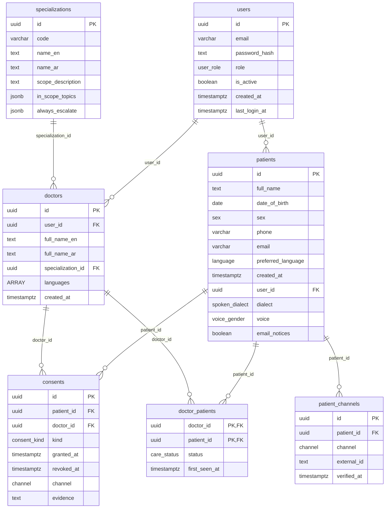
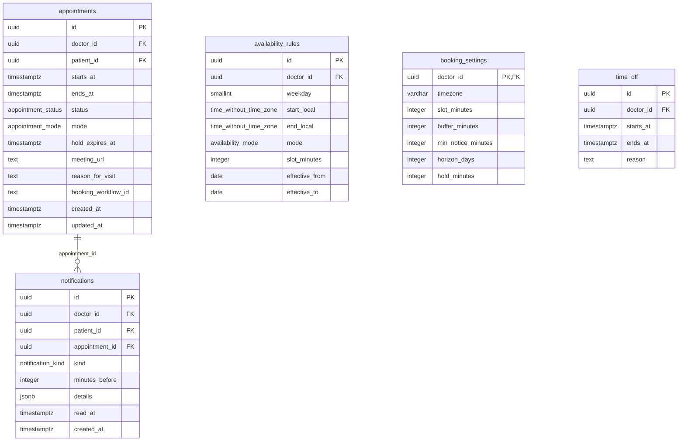
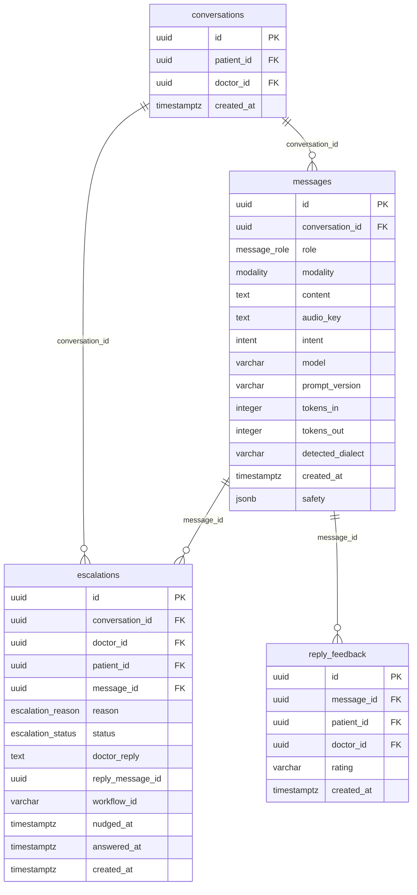
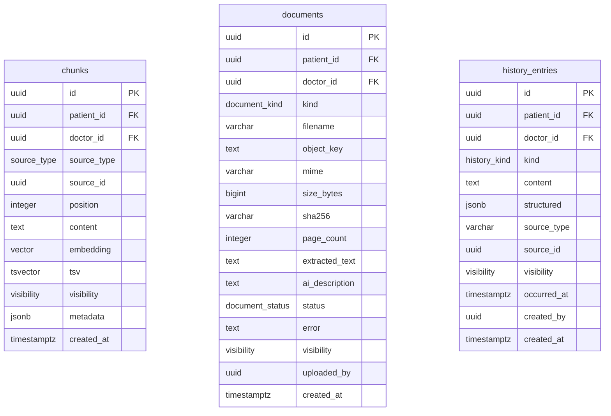
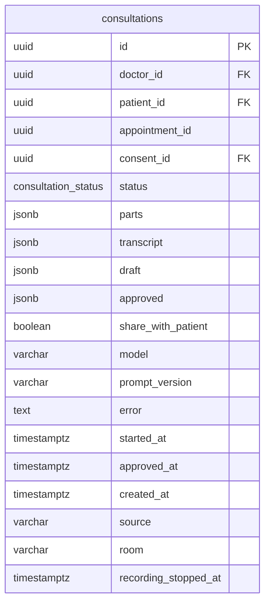
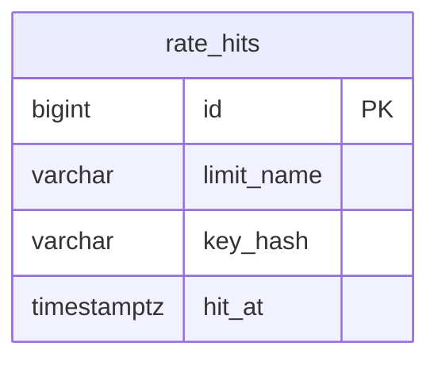
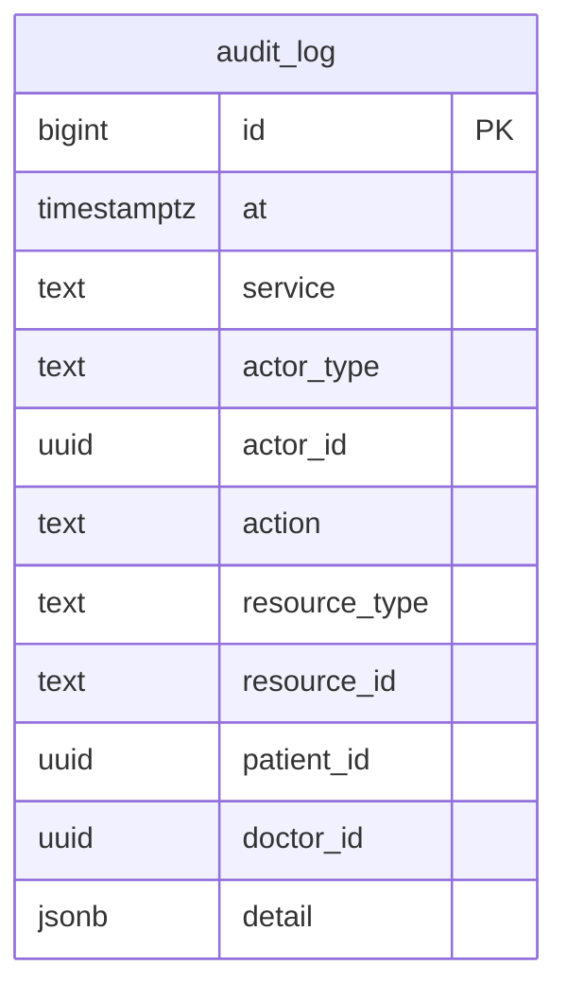

# Database schema

Generated from a migrated database by `scripts/schema_doc.py`; do not edit by hand.
Run `uv run python -m scripts.schema_doc` after a migration.

One Postgres database, one schema per service. A service logs in with a role that holds
its own schema and nothing else (`deploy/postgres/roles.sql`); row-level security then
narrows every row to the doctor or patient the request is for (`nafas_core.db.session_scope`).

## `identity`

The identity service: accounts, doctors, patients, care links, consents.

| Table | Row-level security |
| --- | --- |
| `consents` | `doctor_isolation` (all): `(doctor_id = nafas_current_doctor())` `patient_own_insert` (insert): `(patient_id = nafas_current_patient())` `patient_own_select` (select): `(patient_id = nafas_current_patient())` `patient_own_update` (update): `(patient_id = nafas_current_patient())` |
| `doctor_patients` | `doctor_isolation` (all): `(doctor_id = nafas_current_doctor())` `patient_own_select` (select): `(patient_id = nafas_current_patient())` |
| `doctors` | off (see the isolation sweep for why this table may be open) |
| `patient_channels` | `anyone_inserts` (insert): `true` `linked_doctor_deletes` (delete): `(EXISTS ( SELECT 1 FROM identity.doctor_patients dp WHERE ((dp.patient_id = patient_channels.patient_id) AND (dp.doctor_id = nafas_current_doctor()))))` `linked_doctor_reads` (select): `(EXISTS ( SELECT 1 FROM identity.doctor_patients dp WHERE ((dp.patient_id = patient_channels.patient_id) AND (dp.doctor_id = nafas_current_doctor()))))` `linked_doctor_updates` (update): `(EXISTS ( SELECT 1 FROM identity.doctor_patients dp WHERE ((dp.patient_id = patient_channels.patient_id) AND (dp.doctor_id = nafas_current_doctor()))))` |
| `patients` | `anyone_inserts` (insert): `true` `linked_doctor_deletes` (delete): `(EXISTS ( SELECT 1 FROM identity.doctor_patients dp WHERE ((dp.patient_id = patients.id) AND (dp.doctor_id = nafas_current_doctor()))))` `linked_doctor_reads` (select): `(EXISTS ( SELECT 1 FROM identity.doctor_patients dp WHERE ((dp.patient_id = patients.id) AND (dp.doctor_id = nafas_current_doctor()))))` `linked_doctor_updates` (update): `(EXISTS ( SELECT 1 FROM identity.doctor_patients dp WHERE ((dp.patient_id = patients.id) AND (dp.doctor_id = nafas_current_doctor()))))` `patient_own_select` (select): `(id = nafas_current_patient())` `patient_own_update` (update): `(id = nafas_current_patient())` |
| `specializations` | off (see the isolation sweep for why this table may be open) |
| `users` | off (see the isolation sweep for why this table may be open) |

## `scheduling`

The scheduling service: hours, time off, appointments, notices.

References into other schemas (in the database only, never on the ORM models):

- `appointments.doctor_id` → `identity.doctors`
- `appointments.patient_id` → `identity.patients`
- `availability_rules.doctor_id` → `identity.doctors`
- `booking_settings.doctor_id` → `identity.doctors`
- `notifications.doctor_id` → `identity.doctors`
- `notifications.patient_id` → `identity.patients`
- `time_off.doctor_id` → `identity.doctors`

| Table | Row-level security |
| --- | --- |
| `appointments` | `doctor_isolation` (all): `(doctor_id = nafas_current_doctor())` `patient_own_select` (select): `(patient_id = nafas_current_patient())` |
| `availability_rules` | `doctor_isolation` (all): `(doctor_id = nafas_current_doctor())` |
| `booking_settings` | `doctor_isolation` (all): `(doctor_id = nafas_current_doctor())` |
| `notifications` | `doctor_isolation` (all): `(doctor_id = nafas_current_doctor())` `patient_own_select` (select): `(patient_id = nafas_current_patient())` `patient_own_update` (update): `(patient_id = nafas_current_patient())` |
| `time_off` | `doctor_isolation` (all): `(doctor_id = nafas_current_doctor())` |

## `conversation`

The conversation service: the patient's chat, escalations, reply ratings.

References into other schemas (in the database only, never on the ORM models):

- `conversations.doctor_id` → `identity.doctors`
- `conversations.patient_id` → `identity.patients`
- `escalations.doctor_id` → `identity.doctors`
- `escalations.patient_id` → `identity.patients`
- `reply_feedback.doctor_id` → `identity.doctors`
- `reply_feedback.patient_id` → `identity.patients`

| Table | Row-level security |
| --- | --- |
| `conversations` | `party_access` (all): `((patient_id = nafas_current_patient()) OR (doctor_id = nafas_current_doctor()))` |
| `escalations` | `party_access` (all): `((patient_id = nafas_current_patient()) OR (doctor_id = nafas_current_doctor()))` |
| `messages` | `party_access` (all): `(EXISTS ( SELECT 1 FROM conversation.conversations c WHERE ((c.id = messages.conversation_id) AND ((c.patient_id = nafas_current_patient()) OR (c.doctor_id = nafas_current_doctor())))))` |
| `reply_feedback` | `party_access` (all): `((patient_id = nafas_current_patient()) OR (doctor_id = nafas_current_doctor()))` |

## `clinical`

The clinical-records service: history, documents and their searchable passages.

References into other schemas (in the database only, never on the ORM models):

- `chunks.doctor_id` → `identity.doctors`
- `chunks.patient_id` → `identity.patients`
- `documents.doctor_id` → `identity.doctors`
- `documents.patient_id` → `identity.patients`
- `history_entries.doctor_id` → `identity.doctors`
- `history_entries.patient_id` → `identity.patients`

| Table | Row-level security |
| --- | --- |
| `chunks` | `doctor_isolation` (all): `(doctor_id = nafas_current_doctor())` `patient_visible_reads` (select): `((patient_id = nafas_current_patient()) AND (visibility = 'patient_visible'::clinical.visibility))` |
| `documents` | `doctor_isolation` (all): `(doctor_id = nafas_current_doctor())` `patient_visible_reads` (select): `((patient_id = nafas_current_patient()) AND (visibility = 'patient_visible'::clinical.visibility))` |
| `history_entries` | `doctor_isolation` (all): `(doctor_id = nafas_current_doctor())` `patient_visible_reads` (select): `((patient_id = nafas_current_patient()) AND (visibility = 'patient_visible'::clinical.visibility))` |

## `consultation`

The consultation service: recorded visits.

References into other schemas (in the database only, never on the ORM models):

- `consultations.consent_id` → `identity.consents`
- `consultations.doctor_id` → `identity.doctors`
- `consultations.patient_id` → `identity.patients`

| Table | Row-level security |
| --- | --- |
| `consultations` | `doctor_isolation` (all): `(doctor_id = nafas_current_doctor())` |

## `edge`

The gateway: rate limits shared by its replicas.

| Table | Row-level security |
| --- | --- |
| `rate_hits` | off (see the isolation sweep for why this table may be open) |

## `audit`

The every service appends; no service reads.

| Table | Row-level security |
| --- | --- |
| `audit_log` | off (see the isolation sweep for why this table may be open) |
